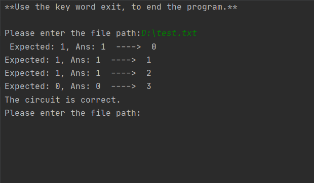
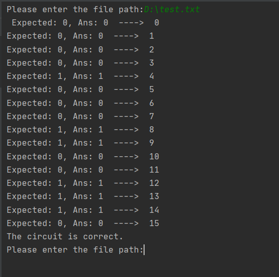

# Welcome to logic expression checker
## Main Purpose 
The main purpose of the program is to check a logic circuit expression and make sure that it is outputting the required values.

## Syntax
The program can handle the main logic circuit gates `NOT`, `AND`, and `OR`.

You need to use the following symboles so the program can parse your logic expression properly:
|Gate| Syntax symbole |
|--|--|
| NOT | ! |
| AND | . |
| OR  | + |

You can also use open parentheses `(` ,closed parentheses `)`,  and bit values `0 or 1`.

For ex:

    !(A + B) . (A . B) + !((1 + B) . (0 . B))

## How to use
The program will ask for a text file path that the program will parse and check the provided expression.

The text file form must be as following:

**First line:** The variables names separated by space or tab `\t`.

**Second line:** The logic expression.

**The rest of lines:** for the rest of file every line will be the expected output of the logic function in order.

Example of a valid file:

    A B
    !(A+B).(A.B)+!((A+B).(A.B))
    1
    1
    1
    0

| line number | line content | comment |
|--|--|--|
| 1 | A B | the logic expression variables|
| 2 | !(A+B).(A.B)+!((A+B).(A.B)) | The logic expression|
| 3 | 1   | the output of the function when A = 0 and B = 0
| 4 | 1   | the output of the function when A = 0 and B = 1
| 5 | 1   | the output of the function when A = 1 and B = 0
| 6 | 0   | the output of the function when A = 1 and B = 1

## Screenshots

